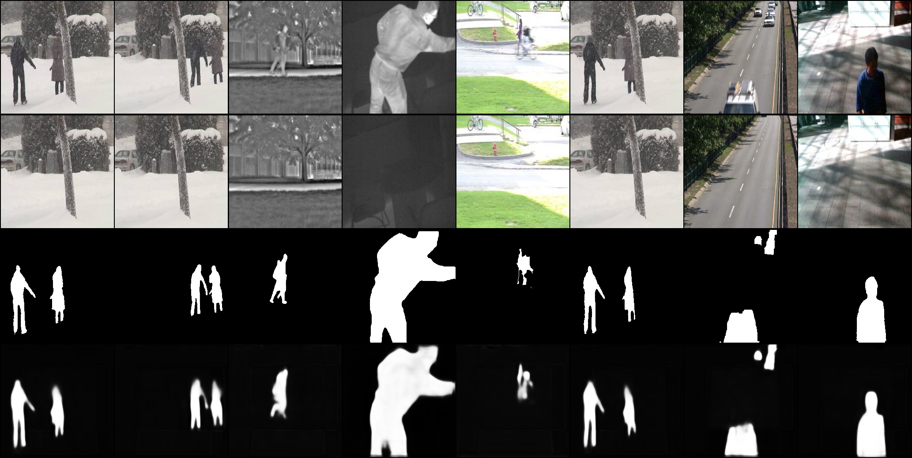

# foreground segmentation with semi-supervised learning
This is the foreground segmentation task with semi-supervised learning.
# Setup Dataset
You can download the dataset here:
[CDNet2014](https://www.kaggle.com/datasets/fc82cc044b7e90db502e947e3a4d301a0ff2c498a38b75522543304a40c764f5)
[SBI](https://sbmi2015.na.icar.cnr.it/SBIdataset.html)
[SBM-RGBD](https://rgbd2017.na.icar.cnr.it/SBM-RGBDdataset.html#groundtruths)
The dataset should be organized in the following way:  
```
./dataset/  
    /label/  
        /category1/  
            /input/...  
            /groundtruth/...  
            /background/...  
        /category2/...  
    /unlabel/  
        /category1/  
            /input/...  
            /groundtruth/  
            /background/...  
        /category2/...  
```
# Train Model
You can train the model with the following command.
More options can be found in "./options/BaseOptions.py".
`python train.py --batchSize 4 --lr 0.0001 --cuda True`  
# Visualize Result
You can view the results of the model with the following command.
Here are some sample results:

`cd ./utils`  
`python visualize.py`  

